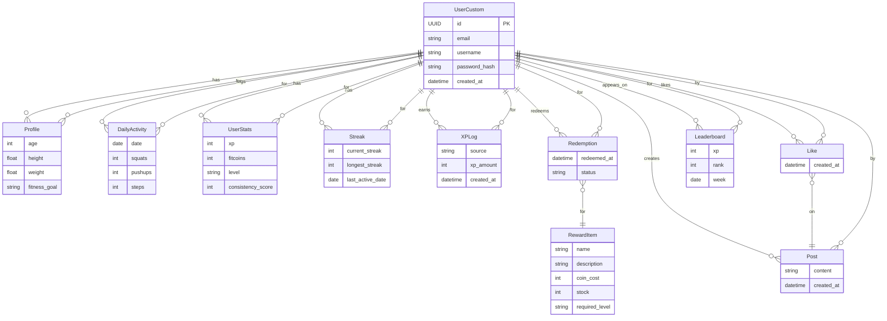

# 🦾 Consistify
**Gamified Fitness Tracking App for Consistency & Habit Formation**  
Built with ❤️ at Reckon 7.0 Hackathon (March 2026)
---

## 📋 Table of Contents
- [Overview](#overview)
- [Problem Statement](#problem-statement)
- [Target Users & Pain Points](#target-users--pain-points)
- [Core Philosophy](#core-philosophy)
- [Solution Architecture](#solution-architecture)
- [Gamification Flow](#gamification-flow)
- [Feature Matrix](#feature-matrix)
- [Technical Stack](#technical-stack)
- [Security & Anti-Cheat](#security--anti-cheat)
- [API Documentation](#api-documentation)
- [Data Model](#data-model)
- [Installation & Setup](#installation--setup)
- [Usage Guide](#usage-guide)
- [Project Structure](#project-structure)
- [Contributing](#contributing)
- [License](#license)

---
## 🎯 Overview
Consistify is a gamified fitness tracking app that rewards **consistency** over intensity. It transforms daily workouts into game-like quests, tracks progress, and offers real-world rewards. Designed for anyone who struggles to stay consistent with fitness routines.

---
## 💼 Problem Statement
**Lack of motivation leads to inconsistent fitness routines.**

Most fitness apps reward high reps or intense workouts, but users often drop off due to lack of daily motivation. There’s a need for a system that makes fitness fun, habit-forming, and rewarding for everyone.

---
## 🎯 Target Users & Pain Points
| User Type         | Primary Need                | Pain Point                  |
|-------------------|----------------------------|-----------------------------|
| Beginners         | Build a daily habit        | Intimidated by intensity    |
| Busy Professionals| Quick, effective routines  | Lack of time/motivation     |
| Fitness Enthusiasts| Social competition         | Plateau, boredom            |
| Habit Seekers     | Streaks, rewards           | Inconsistent engagement     |

---
## 🧠 Core Philosophy
Consistify rewards:
- Daily activity
- Habit formation
- Balanced fitness

This aligns with behavioral psychology research on habit formation. **Consistency > Intensity.**

---
## 🏗️ Solution Architecture

### System Architecture Diagram
```mermaid
flowchart TD
	subgraph Mobile App
		A1[User Signup/Onboarding]
		A2[Calibration Test]
		A3[Daily Quest UI]
		A4[Activity Logging]
		A5[Social Feed]
		A6[Rewards Store]
	end
	subgraph Backend API (Django)
		B1[Accounts Service]
		B2[Activity Service]
		B3[Gamification Engine]
		B4[Analytics Service]
		B5[Reward Service]
		B6[Social Service]
	end
	subgraph Database
		D1[(UserCustom)]
		D2[(DailyActivity)]
		D3[(UserStats)]
		D4[(Streak)]
		D5[(XPLog)]
		D6[(RewardItem)]
		D7[(Redemption)]
		D8[(Post)]
		D9[(Like)]
		D10[(Leaderboard)]
		D11[(Profile)]
	end
	A1-->|REST|B1
	A2-->|REST|B2
	A3-->|REST|B2
	A4-->|REST|B2
	A5-->|REST|B6
	A6-->|REST|B5
	B1-->|ORM|D1
	B1-->|ORM|D11
	B2-->|ORM|D2
	B3-->|ORM|D3
	B3-->|ORM|D4
	B3-->|ORM|D5
	B4-->|ORM|D10
	B5-->|ORM|D6
	B5-->|ORM|D7
	B6-->|ORM|D8
	B6-->|ORM|D9
	B1-->|User Auth|A1
	B5-->|Reward Status|A6
	B3-->|Gamification State|A3
	B4-->|Leaderboard|A3
	B6-->|Feed|A5
```

---
## 🕹️ Gamification Flow

### 1️⃣ User Entry (Onboarding)
- **Signup:** Google, email, or phone
- **Minimal questions:** fitness goal, experience, daily availability
- **Calibration test:** 10 squats, 5 pushups, 30 sec walk
- **Initial Consistency Score** and Beast Level assigned

### 2️⃣ Daily Gameplay Loop
- **Daily Quest:** 3 activities (Squats, Pushups, Steps)
- **Sensors:** Camera (for reps), phone step counter
- **XP & FitCoins:** Each activity gives XP and coins

| Activity   | XP   | FitCoins |
|------------|------|----------|
| 10 squats  | 10   | 5        |
| 10 pushups | 12   | 6        |
| 1000 steps | 5    | 3        |

### 3️⃣ Consistency Score System
- **Formula:** 0.5 × streak days + 0.3 × activity completion + 0.2 × steps
- **Example:** Streak 6 days, 80% completion, 5000 steps → Score = 72

### 4️⃣ Beast Progression
| Level   | Animal    | Meaning              |
|---------|-----------|----------------------|
| 0-100   | 🐢 Tortoise| Beginner             |
| 100-300 | 🐺 Wolf    | Developing habit     |
| 300-600 | 🦅 Eagle   | Consistent           |
| 600-1000| 🐆 Leopard | Strong discipline    |
| 1000+   | 🦁 Lion    | Elite consistency    |

### 5️⃣ Streaks & Comebacks
- **Streak bonuses:** 3d (+10 XP), 7d (+30 XP), 14d (+70 XP), 30d (badge)
- **Comeback:** Missed a day? Complete 30 squats to restore 70% streak

### 6️⃣ Achievements & Challenges
- **Milestones:** First Steps (3000 steps), Squat Starter (100 squats), etc.
- **Weekly Challenge:** e.g., 300 squats/week → 100 XP + 50 coins

### 7️⃣ FitCoin Economy & Store
- **Earn coins:** daily workout, streaks, challenges, achievements
- **Redeem:** Stickers (200), Wristband (500), Towel (900), Bottle (1200), T-shirt (2500)

### 8️⃣ Social Feed & Leaderboards
- **Feed:** Share achievements, like/comment, challenge friends
- **Leaderboards:** Weekly XP, steps, streaks

### 9️⃣ Anti-Cheat & Retention
- **Rep speed validation:** >0.8s/rep
- **Daily XP cap:** 150
- **Camera verification:** Pose detection
- **Monthly quests & Beast Evolution events**

---
## 🏅 Feature Matrix
| Feature                | Description                                      |
|------------------------|--------------------------------------------------|
| Consistency Score      | Rewards daily activity, not just intensity        |
| Beast Progression      | Evolve avatar as you build habits                 |
| Daily/Weekly Quests    | Fresh challenges every day & week                 |
| Streaks & Comebacks    | Maintain streaks, recover from missed days        |
| Achievements           | Milestone badges for key fitness goals            |
| FitCoin Economy        | Earn coins, redeem for real-world rewards         |
| Merchandise Store      | Buy exclusive Consistify gear with FitCoins       |
| Leaderboards           | Friendly competition for XP, steps, streaks       |
| Social Feed            | Share progress, like/comment, challenge friends   |
| Anti-Cheat             | Camera validation, XP caps, fair play checks      |

---
## 🏗️ Technical Stack
| Component      | Technology         | Version   | Purpose                        |
|---------------|--------------------|-----------|---------------------------------|
| Backend       | Django             | 4.x       | REST API, business logic        |
| Language      | Python             | 3.8+      | Core backend                    |
| Mobile App    | Android (Java)     | 8+        | User interface, sensors         |
| Build Tool    | Gradle             |           | Android build                   |
| Database      | SQLite/PostgreSQL  |           | Data storage                    |
| ORM           | Django ORM         |           | Database abstraction            |
| Sensors       | Camera, Step Count |           | Activity detection              |
| API Comm      | REST               |           | App-backend communication       |

---
## 🛡️ Security & Anti-Cheat
- **Authentication:** Secure password hashing, unique user IDs
- **CSRF Protection:** Django middleware
- **Rate Limiting:** Prevent brute-force
- **Input Validation:** All forms and API endpoints
- **Anti-Cheat:**
	- Rep speed validation (>0.8s)
	- Daily XP cap (150)
	- Camera pose detection

---
## 🔌 API Documentation

### Authentication & Profile
| Method | Endpoint                | Description                | Auth |
|--------|-------------------------|----------------------------|------|
| POST   | /api/accounts/signup/   | Register new user          | ❌   |
| POST   | /api/accounts/login/    | User login                 | ❌   |
| GET    | /api/accounts/profile/  | Get user profile           | ✅   |

### Activity Tracking
| Method | Endpoint                        | Description                        |
|--------|----------------------------------|------------------------------------|
| POST   | /api/activity/log/               | Log activity (squats, pushups, steps) |
| GET    | /api/activity/today/             | Get today’s activity                |
| GET    | /api/activity/history/           | Get activity history (paginated)    |
| GET    | /api/activity/get_activity/      | Get activity for a specific date    |

### Gamification
| Method | Endpoint                        | Description                        |
|--------|----------------------------------|------------------------------------|
| POST   | /api/gamification/process/       | Process daily gamification loop     |
| GET    | /api/gamification/status/        | Get user’s gamification state       |

### Analytics
| Method | Endpoint                        | Description                        |
|--------|----------------------------------|------------------------------------|
| GET    | /api/analytics/dashboard/        | Get dashboard summary               |
| GET    | /api/analytics/weekly/           | Get weekly chart data               |
| GET    | /api/analytics/leaderboard/      | Get leaderboard                     |

### Rewards
| Method | Endpoint                        | Description                        |
|--------|----------------------------------|------------------------------------|
| GET    | /api/reward/list/                | List available rewards              |
| POST   | /api/reward/redeem/              | Redeem a reward                     |
| GET    | /api/reward/history/             | Get user’s redemption history       |

### Social Feed
| Method | Endpoint                        | Description                        |
|--------|----------------------------------|------------------------------------|
| GET    | /api/social/feed/<page>/         | Get social feed (paginated)         |
| POST   | /api/social/create/              | Create a post                       |
| POST   | /api/social/like/                | Like a post                         |

---
### Example API Request: Log Activity
```http
POST /api/activity/log/
Content-Type: application/x-www-form-urlencoded

user_id=1234&date=2026-03-14&squats=20&pushups=10&steps=5000
```

### Example API Request: Process Gamification
```http
POST /api/gamification/process/
Content-Type: application/x-www-form-urlencoded

user_id=1234&squats=20&pushups=10&steps=5000
```

---
## 🗄️ Data Model (ER Diagram)


---
## 🚀 Installation & Setup
### Prerequisites
- Python 3.8+
- Django 4.0+
- Android Studio (for app)
- Java 8+
- Gradle

### Backend Setup
```bash
cd backend
python -m venv venv
venv\Scripts\activate  # On Windows
pip install -r requirements.txt
python manage.py migrate
python manage.py runserver
# Access at http://localhost:8000/
```

### Android App Setup
```bash
cd consistifyapp
# Open in Android Studio
# Build & run on emulator or device
```

---
## 📖 Usage Guide
### User Journey Example
**Day 1:**
- User joins Consistify, completes first workout, earns 40 XP

**Day 7:**
- 7-day streak, unlocks Wolf level, earns 120 coins

**Day 30:**
- Reaches Eagle level, redeems Consistify water bottle

**Day 60:**
- Becomes Leopard, competes in leaderboard

### API Usage Flow
1. **Sign up** and set your fitness goal.
2. **Calibrate** with a quick test (squats, pushups, walk).
3. **Complete daily quests** to earn XP & FitCoins.
4. **Maintain streaks** for bonus rewards.
5. **Level up** your Beast Avatar as your Consistency Score grows.
6. **Redeem FitCoins** for real merchandise.
7. **Share** your progress and compete on leaderboards.

---
## 📂 Project Structure
```
backend/           # Django backend
	manage.py
	backend/         # Django project settings
		settings.py
		urls.py
		...
	activity/        # Activity tracking APIs
	accounts/        # User authentication APIs
	analytics/       # Dashboard, leaderboard, weekly stats
	gamification/    # Gamification logic & XP
	reward/          # Rewards & merchandise APIs
	social/          # Social feed APIs
consistifyapp/     # Android app (Java)
	build.gradle.kts
	app/
		src/
			main/
				java/com/example/consistify_app/
					MainActivity.java
					ApiClient.java
				res/
					layout/
					values/
					...
```

---
## 🤝 Contributing
We welcome contributions! Please fork the repo, create a feature branch, and submit a pull request. For major changes, open an issue first to discuss what you’d like to change.

---
## 📝 License
This project is licensed under the MIT License. See LICENSE for details.

---
## 👥 Team & Credits
Lead Developer: Deep Shah (@dpshah23)
Built at Reckon 7.0 Hackathon

---
## ⭐️ If you like Consistify, give us a star!

- **Consistency Score:** Rewards daily activity, not just intensity
- **Beast Progression:** Evolve your avatar as you build habits
- **Daily/Weekly Quests:** Fresh challenges every day & week
- **Streaks & Comebacks:** Maintain streaks, recover from missed days
- **Achievements:** Milestone badges for key fitness goals
- **FitCoin Economy:** Earn coins, redeem for real-world rewards
- **Merchandise Store:** Buy exclusive Consistify gear with FitCoins
- **Leaderboards:** Friendly competition for XP, steps, and streaks
- **Social Feed:** Share progress, like/comment, and challenge friends
- **Anti-Cheat:** Camera validation, XP caps, and fair play checks

---

## 🏗️ Technical Stack
**Backend:** Django (Python)

**Mobile App:** Android (Java, Gradle)

**Sensors:** Camera (pose detection), Phone step counter

**Database:** SQLite/PostgreSQL (Django ORM)

**Other:**
- REST API for backend-app communication
- Gradle for Android build

---

## 🔌 API Documentation

### Authentication & Profile
| Method | Endpoint                | Description                | Auth |
|--------|-------------------------|----------------------------|------|
| POST   | /api/accounts/signup/   | Register new user          | ❌   |
| POST   | /api/accounts/login/    | User login                 | ❌   |
| GET    | /api/accounts/profile/  | Get user profile           | ✅   |

### Activity Tracking
| Method | Endpoint                        | Description                        |
|--------|----------------------------------|------------------------------------|
| POST   | /api/activity/log/               | Log activity (squats, pushups, steps) |
| GET    | /api/activity/today/             | Get today’s activity                |
| GET    | /api/activity/history/           | Get activity history (paginated)    |
| GET    | /api/activity/get_activity/      | Get activity for a specific date    |

### Gamification
| Method | Endpoint                        | Description                        |
|--------|----------------------------------|------------------------------------|
| POST   | /api/gamification/process/       | Process daily gamification loop     |
| GET    | /api/gamification/status/        | Get user’s gamification state       |

### Analytics
| Method | Endpoint                        | Description                        |
|--------|----------------------------------|------------------------------------|
| GET    | /api/analytics/dashboard/        | Get dashboard summary               |
| GET    | /api/analytics/weekly/           | Get weekly chart data               |
| GET    | /api/analytics/leaderboard/      | Get leaderboard                     |

### Rewards
| Method | Endpoint                        | Description                        |
|--------|----------------------------------|------------------------------------|
| GET    | /api/reward/list/                | List available rewards              |
| POST   | /api/reward/redeem/              | Redeem a reward                     |
| GET    | /api/reward/history/             | Get user’s redemption history       |

### Social Feed
| Method | Endpoint                        | Description                        |
|--------|----------------------------------|------------------------------------|
| GET    | /api/social/feed/<page>/         | Get social feed (paginated)         |
| POST   | /api/social/create/              | Create a post                       |
| POST   | /api/social/like/                | Like a post                         |

---

### Example API Request: Log Activity
```http
POST /api/activity/log/
Content-Type: application/x-www-form-urlencoded

user_id=1234&date=2026-03-14&squats=20&pushups=10&steps=5000
```

### Example API Request: Process Gamification
```http
POST /api/gamification/process/
Content-Type: application/x-www-form-urlencoded

user_id=1234&squats=20&pushups=10&steps=5000
```

---

## 🚀 Installation & Setup
### Prerequisites
- Python 3.8+
- Django 4.0+
- Android Studio (for app)
- Java 8+
- Gradle

### Backend Setup
```bash
cd backend
python -m venv venv
venv\Scripts\activate  # On Windows
pip install -r requirements.txt
python manage.py migrate
python manage.py runserver
# Access at http://localhost:8000/
```

### Android App Setup
```bash
cd consistifyapp
# Open in Android Studio
# Build & run on emulator or device
```

---

## 📖 Usage Guide
1. **Sign up** and set your fitness goal.
2. **Calibrate** with a quick test (squats, pushups, walk).
3. **Complete daily quests** to earn XP & FitCoins.
4. **Maintain streaks** for bonus rewards.
5. **Level up** your Beast Avatar as your Consistency Score grows.
6. **Redeem FitCoins** for real merchandise.
7. **Share** your progress and compete on leaderboards.

---

## 📂 Project Structure
```
backend/           # Django backend
  manage.py
  backend/         # Django project settings
	 settings.py
	 urls.py
	 ...
  activity/        # Activity tracking APIs
  accounts/        # User authentication APIs
  analytics/       # Dashboard, leaderboard, weekly stats
  gamification/    # Gamification logic & XP
  reward/          # Rewards & merchandise APIs
  social/          # Social feed APIs
consistifyapp/     # Android app (Java)
  build.gradle.kts
  app/
	 src/
		main/
		  java/com/example/consistify_app/
			 MainActivity.java
			 ApiClient.java
		  res/
			 layout/
			 values/
			 ...
```

---

## 🤝 Contributing
We welcome contributions! Please fork the repo, create a feature branch, and submit a pull request. For major changes, open an issue first to discuss what you’d like to change.

---

## 📝 License
This project is licensed under the MIT License. See LICENSE for details.

---

## 👥 Team & Credits
Lead Developer: Deep Shah (@dpshah23)
Built at Reckon 7.0 Hackathon

---

## ⭐️ If you like Consistify, give us a star!